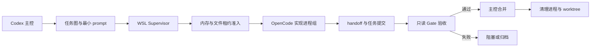

# WSL Codex OpenCode Orchestrator

在 Windows 主机上，由 Codex 作为主控 agent，在指定 WSL2 发行版中调度多个 OpenCode 子 agent，按文件边界并行开发、分段测试、合并结果，并自动回收进程组、worktree 和租约。

本项目适合以下场景：

- 用户只提供需求文档、设计文档目录和项目产出目录。
- Codex 负责任务拆解、任务图、最小化 prompt、监督、验收和合并。
- WSL 内 OpenCode 每次只执行一个边界清晰的实现任务。
- 测试 agent 只读验收，不修改业务代码。
- 任务数量较多，但需要受 WSL 和 Windows 主机内存限制。

> 当前版本是 WSL2 运行时技能，不替换 Windows 原生版本。

## 文档导航

- [快速开始](docs/快速开始.md) / `[[快速开始.md]]`
- [使用说明](使用说明.md) / `[[使用说明.md]]`
- [配置参考](docs/配置参考.md) / `[[配置参考.md]]`
- [任务协议](docs/任务协议.md) / `[[任务协议.md]]`
- [运行机制](docs/运行机制.md) / `[[运行机制.md]]`
- [故障排查](docs/故障排查.md) / `[[故障排查.md]]`
- [详细设计文档](详细设计文档.md) / `[[详细设计文档.md]]`
- [贡献指南](CONTRIBUTING.md) / `[[CONTRIBUTING.md]]`
- [安全说明](SECURITY.md) / `[[SECURITY.md]]`

## 工作方式



每个任务拥有独立的 task id、分支、worktree、prompt、租约、进程组和 Gate 结果。调度器不会使用 `pkill node`、`pkill bun` 等宽泛命令，而是基于任务 PID、PGID、启动时间和受限 worktree 进行清理。

## 核心特性

- **主控职责固定**：Codex 规划、监督、Gate 验收、合并和清理；OpenCode 不负责拆解任务。
- **文件边界并行**：通过 `allowed_files` 和 Lease 防止两个实现 agent 同时修改同一文件。
- **双层内存保护**：同时检查 WSL 内存和 Windows 主机内存，任一侧达到停止阈值就暂停新增任务。
- **模型回退**：优先使用 `opencode-go/deepseek-v4-flash`，启动失败时只回退一次到 `opencode-go/gpt-5.6-luna`。
- **自动依赖补齐**：启动时自动安装固定白名单中的 Ubuntu 系统包；不自动修改 OpenCode 认证和模型配置。
- **快速资源回收**：Supervisor 默认每 30 秒检查一次已完成任务并释放进程、worktree 和 Lease。
- **分段验收**：要求 handoff、文件范围、任务测试和 Gate 结果全部满足后才允许合并。
- **可恢复状态**：任务状态、租约、事件、Gate 和报告均保存到项目 `.opencode/` 目录。

## 环境要求

- Windows 10/11，启用 WSL2。
- 一个明确指定的 WSL2 发行版，例如 `Ubuntu`。
- WSL 内可联网安装 Linux 版 `opencode`；Supervisor 会自动安装到 `~/.opencode/bin` 并写入 `~/.profile`。首次使用后仍需在 WSL 内执行 `opencode auth`。
- 项目优先放置在 WSL Linux 文件系统，例如 `/home/<user>/projects/<project>`。
- OpenCode 模型可用：主模型 `opencode-go/deepseek-v4-flash`，备用模型 `opencode-go/gpt-5.6-luna`。

## 快速开始

### 1. 准备项目

```bash
mkdir -p /home/<user>/projects/<project>/.opencode
cd /home/<user>/projects/<project>
git status
opencode auth
```

将主控生成的 `wsl-config.json` 和 `tasks.json` 放到项目 `.opencode/` 目录。

### 2. 启动 Supervisor

在 Windows PowerShell 中执行：

```powershell
wsl.exe -d Ubuntu -- bash -lc 'cd /home/<user>/projects/<project> && bash /path/to/wsl-codex-opencode-orchestrator/scripts/supervisor-loop.sh .opencode/wsl-config.json'
```

Supervisor 会先自动检查依赖，再执行配置、Git、OpenCode、模型、路径和内存预检。预检失败时不会启动任何实现 agent。

### 3. 单独执行预检

```bash
bash scripts/ensure-dependencies.sh
bash scripts/ensure-opencode.sh /home/<user>/projects/<project>/.opencode/wsl-config.json
bash scripts/preflight.sh /home/<user>/projects/<project>/.opencode/wsl-config.json
```

### 4. 查看产物

```bash
find .opencode -maxdepth 3 -type f | sort
bash scripts/report-builder.sh /home/<user>/projects/<project>
```

## 运行状态

运行状态默认位于项目的 `.opencode/`：

```text
.opencode/
├── tasks.json
├── wsl-config.json
├── orchestrator-state.json
├── leases.json
├── events/
├── gates/<task-id>/result.json
├── logs/<task-id>.log
├── processes/<task-id>.json
├── prompts/<task-id>.md
├── worktrees/<task-id>/
├── archives/<task-id>/
└── reports/资源清理报告.md
```

`.opencode/` 是运行产物，默认被 `.gitignore` 忽略。需要保留审计结果时，应将报告或事件导出到项目指定的审计目录，而不是直接提交全部运行缓存。

## 设计边界

- 不为每个 agent 创建独立 WSL 虚拟机；所有 agent 运行在同一个指定发行版内。
- 不混用 Windows 原生 `opencode.exe` 和 WSL 内 OpenCode。
- 不使用全局进程名清理。
- 测试 agent 不写业务代码、不提交业务分支。
- Codex 主控必须审阅 Gate 结果后再合并，`handoff.completed` 不能单独代表任务完成。

## 项目状态

当前仓库包含 WSL Bash 调度运行时、依赖 Bootstrap、进程清理、worktree 管理、租约、Gate、内存保护和 smoke 测试。完整运行仍依赖目标 WSL 发行版中可用的 Linux OpenCode 与已配置模型。

## 许可证与贡献

贡献前请阅读 [贡献指南](CONTRIBUTING.md)。涉及凭据、模型配置、子进程权限或清理逻辑的修改，还必须阅读 [安全说明](SECURITY.md)。
